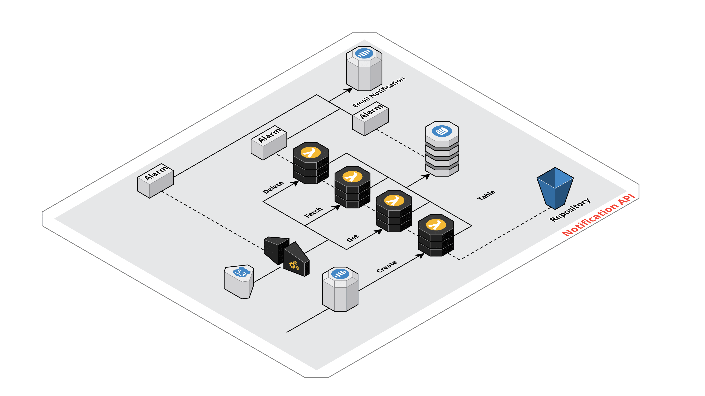

# Notification.Api

## Infrastructure
### AWS
  

| Environment Name | Description                                                                                  |
|:-----------------|:---------------------------------------------------------------------------------------------|
| production       | Production environment, only deployed to if all steps prior succeed & it's master branch     |

| Variable Name                      | Description                                                                           | Default                     |
|:-----------------------------------|:--------------------------------------------------------------------------------------|:----------------------------|
| AlarmActionArn                     | The ARN of the alarm action to invoke when the alarm is triggered                     |                             |
| AlarmDynamoDBSystemErrorsThreshold | Threshold for the DynamoDB system errors alarm                                        | 50                          |
| AlarmLambdaErrorsThreshold         | Threshold for the Lambda errors alarm                                                 | 50                          |
| Alarm4XXsThreshold                 | Threshold for the API Gateway 4XX errors alarm                                        | 50                          |
| Alarm5XXsThreshold                 | Threshold for the API Gateway 4XX errors alarm                                        | 50                          |
| CertificateArn                     | Arn of certificate to use for ssl                                                     |                             |
| CreateFileName                     | File name for the create lambda                                                       |                             |
| CreateQueueMessageRetentionPeriod  | Queue retention period                                                                | 345600                      |
| CreateQueueSNSTopicArn             | Arn of the SNS topic                                                                  |                             |
| DefaultLoglevel                    | Default log level for all Lambdas, passed in as an environment variable to the lambda | info                        |
| DeleteFileName                     | File name for the delete lambda                                                       |                             |
| EnvironmentName                    | Name of the environment                                                               |                             |
| FetchFileName                      | File name for the fetch lambda                                                        |                             |
| HostedZoneUrl                      | Domain name of hosted zone                                                            |                             |
| RepositoryBucketName               | Name of the bucket used for state management                                          | notification-api-repository |
| ServiceName                        | Key of the domain state file                                                          | notification                |
| UserPoolId                         | Id of the cognito user pool                                                           |                             |
| UserWebClientId                    | Id of the cognito web client                                                          |                             |
| UserJWTIssuer                      | JWT issuer                                                                            |                             |

Resources created:
* DNS Record
* SSL certificate
* API Gateway
    * Role 
    * Policy
    * Domain
    * Authorizer
    * Stage
    * Log group
* 3 Lambdas (create, delete, fetch)
    * API Gateway integration
    * API Gateway routes
    * Lambda
    * Log group
    * Role
    * Dynamo DB policy
    * Cloudwatch policy
    * Xray policy
* API Gateway 4XX alarm 
* API Gateway 5XX alarm 
* Lambda errors alarm 
* Dynamo DB errors alarm 
* Dashboard
* Dynamo DB

Development environment only creates the Dynamodb

## Build
## CICD
Project contains a GitHub action workflow.

{"type":"Signup","userId":"user-id","firstName":"Gavan","lastName":"Lamb"}
https://aws.amazon.com/blogs/mobile/understanding-amazon-cognito-user-pool-oauth-2-0-grants/
